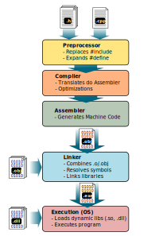

<a name="1_03_compilation_model-1"></a>
# C++ Compilation Model

The **C++ compilation model** consists of five main components:  
1. Header Files (`.h`, `.hpp`)  
2. Translation Units (`.cpp` + included headers)  
3. Preprocessor (Expands macros and includes)  
4. Compiler (Compiles source files using MSVC `cl.exe`)  
5. Linker (Combines compiled files into an executable or library using `link.exe`)  


<a name="1_03_compilation_model-1-1"></a>
## 1. Header Files (`.h`, `.hpp`)
- **Header files** contain **declarations** of functions, classes, and variables but **not implementations**.  
- They are meant to be **included** in multiple source files using `#include`.  
- They help with **code reuse and modularity**.

<a name="1_03_compilation_model-1-1-1"></a>
### Example: `math_utils.h` (Header File)
```cpp
#ifndef MATH_UTILS_H
#define MATH_UTILS_H

int add(int a, int b);  // Function declaration (prototype)

#endif  // MATH_UTILS_H
```
- `#ifndef ... #define ... #endif` prevents **multiple inclusions** of the file.

<a name="1_03_compilation_model-1-2"></a>
## 2. Translation Units (`.cpp` + Included Headers)
- A **translation unit** is a **single source file (`.cpp`)** plus all its included **headers (`.h`)**.
- Each `.cpp` file is **compiled separately** into an **object file (`.obj`)**.
- **Each translation unit has its own compilation context**.

<a name="1_03_compilation_model-1-2-1"></a>
### Example: `math_utils.cpp` (Translation Unit)
```cpp
#include "math_utils.h"  // Include header file

int add(int a, int b) {  // Function definition (implementation)
    return a + b;
}
```

<a name="1_03_compilation_model-1-3"></a>
## 3. Preprocessor (Expands Macros and Includes)

- The **preprocessor** processes directives like `#include`, `#define`, and `#ifdef` before compilation.
- It **replaces macros** and **includes** the content of header files into source files.
- Produces an **expanded source file** that is passed to the compiler.

<a name="1_03_compilation_model-1-3-1"></a>

### Preprocessing Example 

#### Using gcc

```sh
g++ -E math_utils.cpp -o math_utils.i
```
- `-E`: Runs only the preprocessor 
- `-o math_utils.i`: Writes the output to `math_utils.i`
This will produce a file (`math_utils.i`) that contains the fully preprocessed source code.


#### Using MSVC `cl.exe`

```sh
cl /P math_utils.cpp /Fi:math_utils.i
```
- `/P`: Runs only the preprocessor.
- `/Fi:`: Specifies the output preprocessed file (`math_utils.i`).


<a name="1_03_compilation_model-1-4"></a>
## 4. Compiler (Compiles Each Translation Unit)
- The **compiler processes each translation unit separately**, performing:
  1. **Preprocessing**: Expands `#include` files, replaces macros.
  2. **Compilation**: Translates C++ code into assembly/machine code.
  3. **Optimization**: Improves performance.
  4. **Code Generation**: Produces object files (`.obj`).

<a name="1_03_compilation_model-1-4-1"></a>
### Compilation Example 

#### Using gcc

```sh
g++ -c math_utils.cpp -o math_utils.o
```

- `-c`: Compile only, do not link
- `-o math_utils.o`: Specify the name of the output object file 

- This will produce `math_utils.o`, the compiled object file.


#### Using MSVC `cl.exe`

```sh
cl /c math_utils.cpp /Fo:math_utils.obj
```
- `/c`: Compile without linking.
- `/Fo:`: Specifies output object file (`math_utils.obj`).


<a name="1_03_compilation_model-1-5"></a>
## 5. Linker (Combines Object Files into Executable)
- The **linker** combines multiple object files (`.obj`) into a single **executable (`.exe`)**.
- It resolves **symbol references** (e.g., function calls across files).
- It **links system libraries** (e.g., `kernel32.lib`, `windowsapp.lib`).

<a name="1_03_compilation_model-1-5-1"></a>
### Example: Linking 

#### Using `g++`

```sh
g++ math_utils.o main.o -o my_program
```

* Produces `my_program` (executable on Unix-like systems, or `my_program.exe` on Windows).


#### Using `link.exe`
```sh
link math_utils.obj main.obj /OUT:my_program.exe
```
- Produces `my_program.exe` (Windows executable).


<a name="1_03_compilation_model-1-6"></a>
## Putting It All Together




<a name="1_03_compilation_model-1-7"></a>
## Complete Example
<a name="1_03_compilation_model-1-7-1"></a>
### Header (`math_utils.h`)
```cpp
#ifndef MATH_UTILS_H
#define MATH_UTILS_H

int add(int a, int b);

#endif
```

<a name="1_03_compilation_model-1-7-2"></a>
### Implementation (`math_utils.cpp`)
```cpp
#include "math_utils.h"

int add(int a, int b) {
    return a + b;
}
```

<a name="1_03_compilation_model-1-7-3"></a>
### Main File (`main.cpp`)
```cpp
#include <iostream>
#include "math_utils.h"

int main() {
    std::cout << "Sum: " << add(3, 4) << std::endl;
    return 0;
}
```

<a name="1_03_compilation_model-1-7-4"></a>
### Compilation & Linking Commands 

#### Using `g++`

```sh
g++ -E math_utils.cpp -o math_utils.i     # Preprocess math_utils.cpp
g++ -c math_utils.cpp -o math_utils.o     # Compile math_utils.cpp
g++ -c main.cpp -o main.o                 # Compile main.cpp
g++ math_utils.o main.o -o my_program     # Link object files into executable
./my_program                              # Run the program (Unix-like) or my_program.exe on Windows
```

#### Using MSVC
```sh
cl /P math_utils.cpp /Fi:math_utils.i     # Preprocess math_utils.cpp
cl /c math_utils.cpp /Fo:math_utils.obj  # Compile math_utils.cpp
cl /c main.cpp /Fo:main.obj              # Compile main.cpp
link math_utils.obj main.obj /OUT:my_program.exe  # Link object files into executable
my_program.exe                           # Run the program
```

---
[[⇦ Previous](1_02_csharp_vs_cpp_idx.md)]		[[Next  ⇨](1_04_main_idx.md)]		[[Index ⇧](index.md#1_03_compilation_model_idx.md)]
