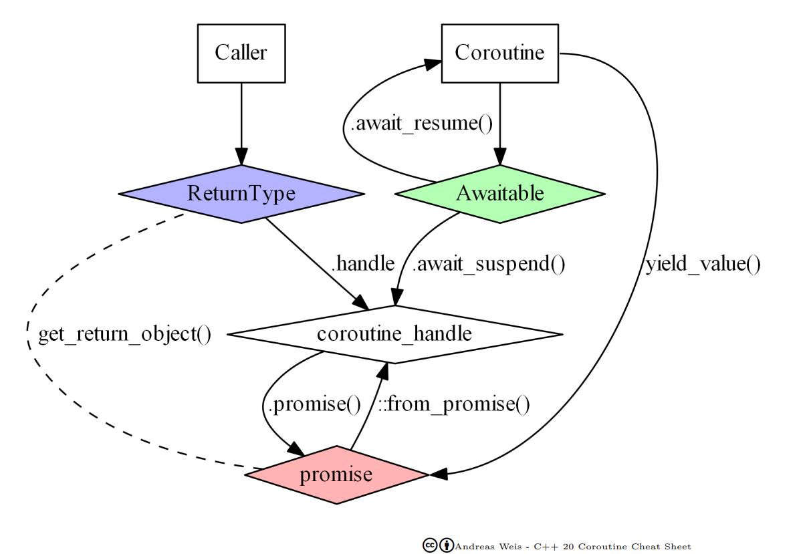

<a name="1_32_coroutines-1"></a>
# Coroutines

<a name="1_32_coroutines-1-1"></a>
##  What Are Coroutines?

- Coroutines are **special functions** that can **suspend** and **resume execution** at specific points.


- Syntatically a function is a coroutine if it has one of the following keywords that cause execution suspension:
	- `co_await` *task* : suspends execution a subtask to be resumed later, returning control to the caller.
	- `co_yield` *value* : suspends execution by returning a value to the caller. The coroutine may be resumed later.
	- `co_return` [ *value* ]: ends coroutine execution, possibly returning a value to the caller. 

- **Resume Later**: The coroutine state is preserved and can be resumed from where it left off.
- **Efficient**: Unlike threads, coroutines don’t require context switching at the OS level.
- Enable asynchronous programming, generators, and cooperative multitasking.


<a name="1_32_coroutines-1-2"></a>
## Using a Coroutine (Library User Perspective)

- As a user, coroutines are called like normal functions
- Unlike normal functions that run to completion to return an end result, coroutines must return an object from a special **Return Type** representing a FSM.
- This type contains a representation of the current **state** of the coroutine (local variables, excecution step, ...), the **coroutine frame**, allocated on the heap, which allows its suspension and later continuation from the point where it left.
- The caller interacts with the coroutine via this handle. 


<a name="1_32_coroutines-1-2-1"></a>
### Example: A Coroutine That Generates Numbers

```cpp
#include <iostream>
#include <coroutine>

// Return Type definiton
struct Generator {
	// ...
};

// Coroutine function
Generator generateNumbers() {
    for (int i = 1; i <= 5; ++i)
        co_yield i;
}

int main() {
    Generator gen = generateNumbers();
    for (int i = 0; i < 5; ++i) {
        std::cout << gen.next() << " ";
    }
    return 0;
}
```
<a name="1_32_coroutines-1-2-2"></a>
### Output
```
1 2 3 4 5
```
<a name="1_32_coroutines-1-2-3"></a>
### How It Works
- `co_yield` suspends execution and saves the current value.
- Calling `next()` resumes the coroutine and gets the next value.
- Execution continues from where it was suspended.


<a name="1_32_coroutines-1-3"></a>
##  Defining a Coroutine

- To implement a coroutine, we need a few key components:

<a name="1_32_coroutines-1-3-1"></a>
### Key Pieces

| Component | Role |
|-----------|------|
| **1. Coroutine Function** | The function that contains `co_await`, `co_yield`, or `co_return`. |
| **2. Return Type** | A special type that interacts with the coroutine. |
| **3. Promise Type** | Manages coroutine state, storing results and handling suspensions. |
| **4. Awaitable Type** | Custom type that defines how `co_await` behaves. |
| **5. Caller** | The function or object that starts/resumes the coroutine. |

<a name="1_32_coroutines-1-3-2"></a>
### 1. Coroutine Function

- As seen above, just a function with one of the `co_` keywords:
	- `co_await`
	- `co_yield`
	- `co_return` 

	and a special user-defined **ReturnType**. 

```cpp
ReturnType someCoroutine(Parameters) {
	// ... 
	// some code containing co_await, co_yield or co_return
	// ...
}
```
⚠️ **Be careful** with references and pointer parameters because the coroutine might outlive them.


<a name="1_32_coroutines-1-3-3"></a>
### 2. The Coroutine Return Type

- The return type **determines** how the coroutine interacts with its caller. 
- It is defined/configurable by the user via a **mandatory internal `promise_type`** provided by the user.
- It is convenient for the return type to have a `coroutine_handle`, which can be used to control the coroutine execution.

```cpp
struct ReturnType {
    struct promise_type {
        // Promise Type definition
        // ...
    };

    std::coroutine_handle<promise_type> handle;

    ReturnType(std::coroutine_handle<promise_type> h) : handle(h) {}
};
```
- The **return type** (`ReturnType`) wraps the coroutine handle.

<a name="1_32_coroutines-1-3-4"></a>
### 3. Promise Type

- The **promise type** manages the coroutine’s state, handling suspension and resumption.
- It is also used to exchange information with the caller.
- The actual definition of the promise type varies slightly depending on the coroutine output, i.e. if the coroutine
	- "returns" nothing (void),
	- "returns" a value, or 
	- "yields" multiple values

<a name="1_32_coroutines-1-3-4-1"></a>
#### Typical structure
```cpp
struct promise_type {
  	ReturnType get_return_object() {
		return {std::coroutine_handle<promise_type>::from_promise(*this)};
    }
    std::suspend_always / std::suspend_never initial_suspend() { return {}; }
    std::suspend_always / std::suspend_never final_suspend() noexcept { return {}; }
    void unhandled_exception() { std::terminate(); }

	// If the coroutine returns nothing
	// This is called by a `co_return;` statement with no args or if the coroutine function ends
    void return_void() {}

	// OR if the coroutine returns a value
	T value;
	// This is called by a `co_return v;` statement 
	void return_value(T v) {
		value = v;
	}

	// OR if the coroutine yields values
	T value;
	// This is called by a `co_yield v;` statement 
    std::suspend_always yield_value(int v) { 
        value = v;
        return {}; 
    }
};
```


<a name="1_32_coroutines-1-3-5"></a>
### 4. Awaitable Type

- A coroutine can `co_await` an object, called **Awaitable**, if it implements three methods:
	- `await_ready()`: If `false`, suspend the coroutine; if `true`, resumes immediately.
	- `await_suspend()`: Defines behavior while suspended.
	- `await_resume()`: Returns value when coroutine resumes.

```cpp
struct Awaitable {
    bool await_ready() { return false; }  // Is the coroutine ready to continue execution ?

	// Called immediately before suspending the coroutine
    void await_suspend(std::coroutine_handle<> h) { 
        // Custom logic when suspending
    }
	
	// Called when the execution of the coroutine resumes 
    T await_resume() { return some_T_result; }  // What should co_await return?
};
```

- Usage:

```cpp
ReturnType someCoroutine() {
    T x = co_await Awaitable{};
    std::cout << "Coroutine resumed with value: " << x << std::endl;
    co_return;
}
```
- `co_await` suspends execution and transfers control to `await_suspend`.
- `await_resume` returns some result when resumed.


<a name="1_32_coroutines-1-3-6"></a>
### 5. Caller Function

- The caller creates a `ReturnType` coroutine object calling the coroutine function.
- From this wrapper object it can access the handle to control de coroutine execution and/or destroy the coroutine frame.

```cpp
int callerFunction(Params) {
	// ...
	ReturnType crObj = someCoroutine(args);
	// eventually the coroutine will get suspended and the control returned to the caller

	// ...
	// then it can be resumed 
	crObj.handle.resume();

	// ...
	// the coroutine output can be accessed via the promise object
	// given that the CR frame has not been yet destroyed
	// (set promise_type::final_suspend() to return std::always_suspend to ensure that)
	T crResult = crObj.handle.promise().value;
	
	// ...
}
```


<a name="1_32_coroutines-1-4"></a>
## Putting It All Together



- The coroutine function gets rewritten by the compiler so that, when it begins executing, it performs the following:
	- Heap-allocates the coroutine state object using operator new. 
	- Copies all function parameters to the coroutine state: by-value parameters are moved or copied, by-reference parameters remain references.
	- Calls the constructor for the promise object. If the promise type has a constructor that takes all coroutine parameters, that constructor is called, with post-copy coroutine arguments. Otherwise the default constructor is called.
	- Calls `promise.get_return_object()` and keeps the result in a local variable. The result of that call will be returned to the caller when the coroutine first suspends. 
	- Calls `promise.initial_suspend()` and co_awaits its result. Typical Promise types either return:
		- `std::suspend_always`, for lazily-started coroutines, or 
		- `std::suspend_never`, for eagerly-started coroutines.
	- When co_await `promise.initial_suspend()` resumes, starts executing the body of the coroutine.
- When a `co_await awaiter` is reached:
    - `awaiter.await_ready()` is called. If it returns: 
        - `true`, then `awaiter.await_resume()` is called and the execution of the coroutine resumes immediately. 
        - `false`, then 
            - The coroutine is suspended (its coroutine state is populated with local variables and current suspension point), and 
            - `awaiter.await_suspend(handle)` is called, where handle is the coroutine handle representing the current coroutine 
                - Inside that function, the suspended coroutine state is observable via that handle
                - It is this function's responsibility to schedule it to resume on some executor, or to be destroyed 
                - If `await_suspend` returns void, control is immediately returned to the caller of the current coroutine (this coroutine remains suspended), otherwise
                - If `await_suspend` returns `bool`:
                    - `true` returns control to the caller/resumer of the current coroutine
                    - `false` resumes the current coroutine.
                - If `await_suspend` returns a coroutine handle for some other coroutine, that handle is resumed.
    - Finally, when the coroutine gets resumed (immediately if `awaiter.await_ready()` returned `true`):
        - `awaiter.await_resume()` is called and its result is the result of the whole co_await expr expression.
- When a coroutine reaches the `co_return` statement (falling off the end of the coroutine is equivalent to `co_return`), it performs the following:
    - Calls 
        - `promise.return_void()` for `co_return` with no arguments or with an argumento of type `void`; or 
        - `promise.return_value(expr)` for `co_return expr;` where `expr` has non-void type.
    - Destroys all variables with automatic storage duration in reverse order they were created.
    - Calls `promise.final_suspend()` and co_awaits the result.
    - Upon resuming from `promise.final_suspend()`:
        - Calls the destructor of the promise object.
        - Calls the destructors of the function parameter copies.
        - Calls operator delete to free the memory used by the coroutine state.
        - Transfers execution back to the caller/resumer.

<a name="1_32_coroutines-1-5"></a>
## Exemple: Number Generator

```cpp
#include <iostream>
#include <coroutine>

// Return Type definiton
struct Generator {
    struct promise_type {
        int current_value;

        Generator get_return_object() { return Generator{std::coroutine_handle<promise_type>::from_promise(*this)}; }
        std::suspend_always initial_suspend() { return {}; }
        std::suspend_always final_suspend() noexcept { return {}; }
        void return_void() {}
        void unhandled_exception() { std::terminate(); }
        std::suspend_always yield_value(int value) { 
            current_value = value;
            return {}; 
        }
    };

    std::coroutine_handle<promise_type> handle;

    Generator(std::coroutine_handle<promise_type> h) : handle{h} {}
    ~Generator() { if (handle) handle.destroy(); }

    int next() {
        if (!handle || handle.done()) return -1; // End of generator
        handle.resume();
        return handle.promise().current_value;
    }
};

// Coroutine function
Generator generateNumbers() {
    for (int i = 1; i <= 5; ++i)
        co_yield i;
}

int main() {
    Generator gen = generateNumbers();
    for (int i = 0; i < 5; ++i) {
        std::cout << gen.next() << " ";
    }
    return 0;
}
```

<a name="1_32_coroutines-1-6"></a>
## Example: Asynchronous Computation

```cpp
#include <iostream>
#include <coroutine>
#include <thread>
#include <chrono>

struct AsyncTask {
    struct promise_type {
        AsyncTask get_return_object() {
            return AsyncTask{std::coroutine_handle<promise_type>::from_promise(*this)};
        }
        std::suspend_never initial_suspend() { return {}; }
        std::suspend_always final_suspend() noexcept { return {}; }
        void return_void() {}
        void unhandled_exception() { std::terminate(); }
    };

    std::coroutine_handle<promise_type> handle;
    AsyncTask(std::coroutine_handle<promise_type> h) : handle(h) {}

    void resume() { handle.resume(); }
};

// Awaitable for async delay
struct Delay {
    bool await_ready() { return false; }
    void await_suspend(std::coroutine_handle<> h) {
        std::thread([h]() {
            std::this_thread::sleep_for(std::chrono::seconds(2));
            h.resume();
        }).detach();
    }
    void await_resume() {}
};

// Coroutine function
AsyncTask asyncFunction() {
    std::cout << "Starting async task...\n";
    co_await Delay{};
    std::cout << "Task finished after delay.\n";
}

int main() {
    auto task = asyncFunction();
    std::cout << "Main function continues...\n";
    std::this_thread::sleep_for(std::chrono::seconds(3));
    return 0;
}
```
<a name="1_32_coroutines-1-6-1"></a>
### **Output**
```
Starting async task...
Main function continues...
Task finished after delay.
```
<a name="1_32_coroutines-1-6-2"></a>
### **Explanation**
- `co_await Delay{}` suspends execution.
- `Delay`'s `await_suspend` launches a **background thread** that resumes the coroutine after a delay.
- `Main function` continues running while coroutine waits asynchronously.


<a name="1_32_coroutines-1-7"></a>
## See More

[1] [C++ Coroutines](https://en.cppreference.com/w/cpp/language/coroutines)

[2] [Deciphering C++ Coroutines - A Diagrammatic Coroutine Cheat Sheet - Andreas Weis - CppCon 2022
](https://www.youtube.com/watch?v=J7fYddslH0Q)

---
[[⇦ Previous](1_31_threads_idx.md)]		[[Next  ⇨](index.md)]		[[Index ⇧](index.md#1_32_coroutines_idx.md)]
